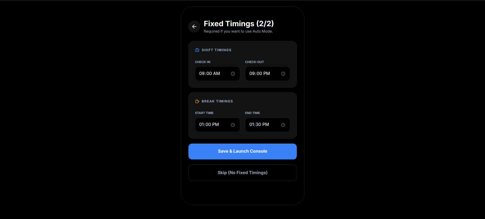
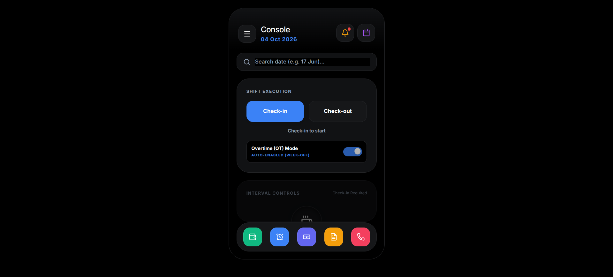
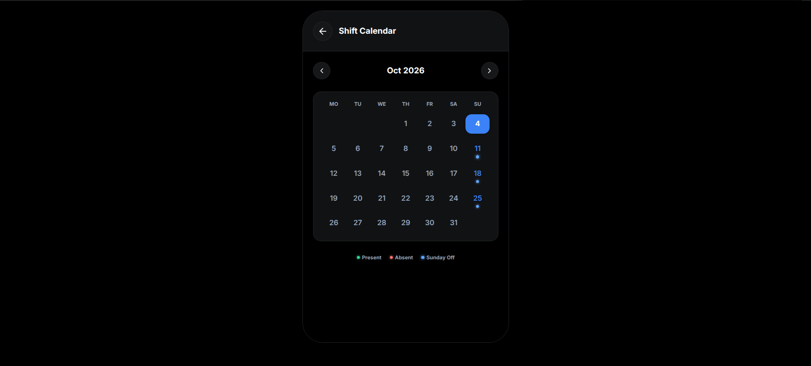
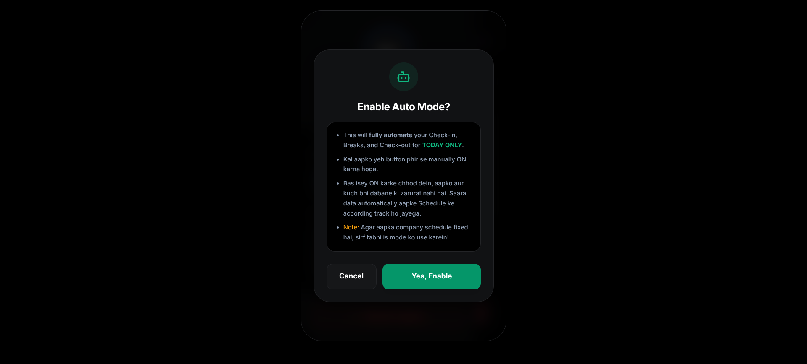
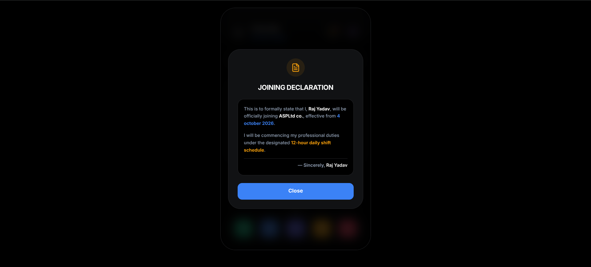

# 🚀 Work ConsolePro v1.0

A modern, high-performance mobile productivity utility designed to seamlessly track work hours, manage shifts, and automate monthly salary computations.

---

## 📱 Interface & Feature Showcase

### 1. Shift & Fixed Timings Setup

  

### 2. Live Console Dashboard

  

### 3. Shift Calendar Integration

  

### 4. Smart Automation (Auto Mode)

  

### 5. Joining Declaration & Customization

  

---

## ✨ Core Features

* **Automated Salary Tracking:** Computes monthly earnings instantly based on custom schedules.
* **Real-time Console:** Quick check-in/check-out with Overtime (OT) mode toggle.
* **Smart Shift Calendar:** Visual tracking for present days, absences, and offs.
* **Mobile-First UI:** Distraction-free dark mode architecture built for high usability.

---

## 📬 Contact & APK Requests

For inquiries, feedback, or to request the official application build, please reach out via email:

* **Email:** [rajy64734@gmail.com](mailto:rajy64734@gmail.com)

---

  <b>Built for professional productivity.</b>

